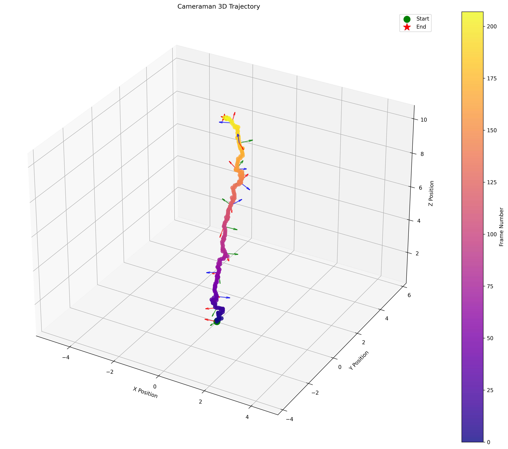
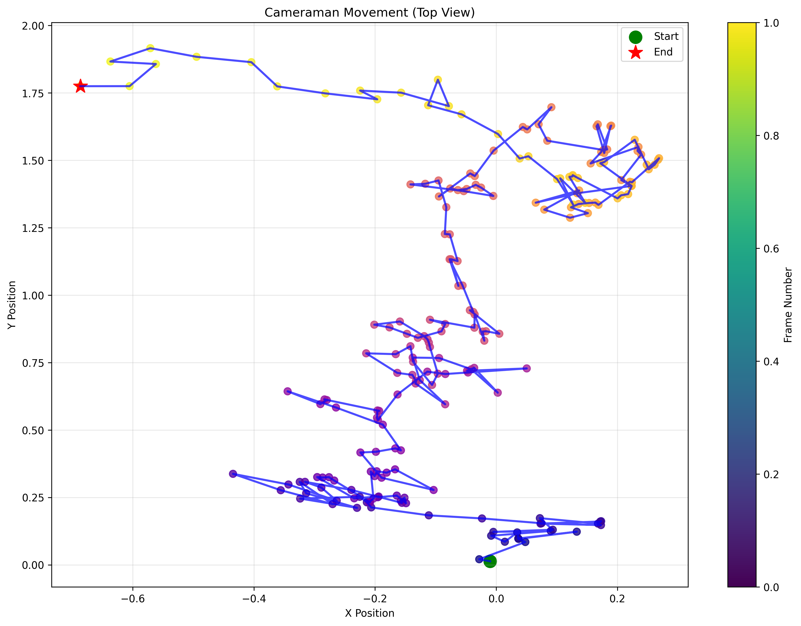
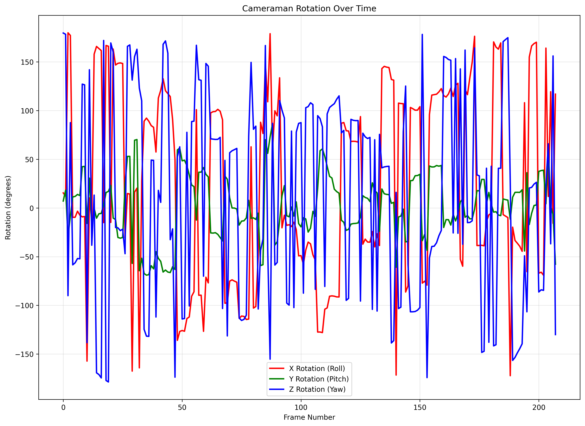
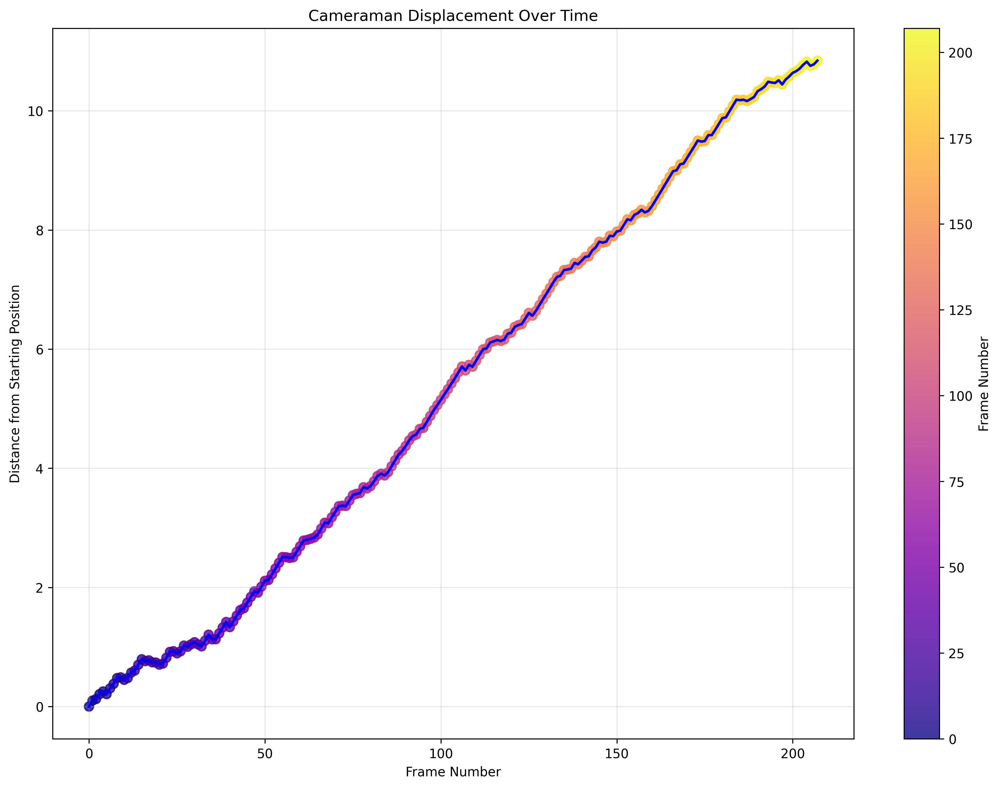

# Duck-Tracker Project

An advanced computer vision system for tracking and analyzing duck trajectories using YOLO object detection and Kalman filtering.

## 📊 [View Interactive Report](https://fluffy-flan-360713.netlify.app/)

<div align="center">
  
</div>

## Overview

This project implements a comprehensive system for tracking and analyzing duck movement in videos, utilizing YOLOv8 for detection and Kalman filters for tracking. The system generates rich visualizations of trajectories, statistical movement analysis, and interactive HTML reports that combine all data into an intuitive interface.

## Key Features

- 🦆 **Duck Detection & Tracking**: Precise identification and monitoring of ducks in video using YOLOv8
- 🔍 **Kalman Filtering**: Advanced motion prediction and trajectory smoothing
- 📈 **Trajectory Visualization**: Detailed 2D and 3D visualizations of movement patterns
- 🎬 **Animated Tracking**: Dynamic animations with vibrant color coding for individual tracking
- 📊 **Statistical Analysis**: Comprehensive movement metrics including velocity, acceleration, and directional analysis
- 📱 **Interactive HTML Reporting**: Rich, browser-based reports combining all visualizations and analyses
- 📹 **Cameraman Movement Analysis**: Tracking the cameraman's movement and rotation throughout the video

## Cameraman Movement Tracking

The project now features robust cameraman movement analysis, providing insight into camera displacement and rotation throughout the video. This helps understand the relationship between camera movement and duck tracking accuracy.

### Cameraman Visualization Examples

<div align="center">
  <table>
    <tr>
      <td></td>
      <td></td>
    </tr>
    <tr>
      <td></td>
      <td></td>
    </tr>
  </table>
</div>

For detailed information about the cameraman tracking functionality, see [cameraman_tracking_README.md](cameraman_tracking_README.md).

## Project Structure

```
Duck-Tracker-Project/
├── batch_processing.py         # Batch video processing pipeline
├── create_animation.py         # Trajectory animation generation
├── create_report.py            # Interactive HTML report generation
├── duck_test1.py               # Main tracker class with Kalman filter
├── movement_analysis.py        # Statistical movement analysis
├── visualize_trajectories.py   # 2D and 3D trajectory visualization
├── cameraman_movement.py       # Cameraman movement analysis
├── visualize_cameraman.py      # Cameraman movement visualization
├── assets/                     # Sample videos and resources
├── batch_output/               # Processing results and visualizations
├── best.pt                     # Trained YOLOv8 model
└── camera_information/         # Camera calibration data
```

## Report Generation System

The project includes a sophisticated report generation system that compiles all analyses, visualizations, and animations into an interactive HTML report:

- **Rich Data Visualization**: Multiple charts, graphs, and 3D models to represent duck movements
- **Comprehensive Metrics**: Detailed statistics for each tracked duck including:
  - Total distance traveled
  - Average and maximum speeds
  - Acceleration patterns
  - Directional analysis
  - Movement efficiency
- **Interactive Elements**: Dynamic components for exploring the data
- **Code Documentation**: Highlighted code snippets explaining key algorithms
- **Cameraman Analysis Integration**: Dedicated section for cameraman movement analysis
- **Video Playback**: Embedded animations of duck trajectories and cameraman movement

## Installation Requirements

```
numpy>=1.20.0
pandas>=1.3.0
matplotlib>=3.4.0
seaborn>=0.11.0
scipy>=1.7.0
tqdm>=4.62.0
ultralytics>=8.0.0
opencv-python>=4.5.0
pygments>=2.10.0
ffmpeg-python>=0.2.0
plotly>=5.5.0
```

## Installation

1. Clone the repository:
```bash
git clone https://github.com/AldonDC/Duck-Tracker-Project.git
cd Duck-Tracker-Project
```

2. Install dependencies:
```bash
pip install -r requirements.txt
```

## Usage

### 1. Process a video in batch mode:
```bash
python batch_processing.py --video assets/DuckVideo.mp4 --output batch_output/
```

### 2. Generate trajectory visualizations:
```bash
python visualize_trajectories.py --input batch_output/combined_data.json --output batch_output/visualizations/
```

### 3. Create animations:
```bash
python create_animation.py --input batch_output/combined_data.json --output batch_output/visualizations/
```

### 4. Analyze cameraman movement:
```bash
python cameraman_movement.py --intrinsics camera_information/intrinsics.npy --essential camera_information/essential_matrices.npy --output batch_output/cameraman_data/cameraman_movement.json
```

### 5. Visualize cameraman movement:
```bash
python visualize_cameraman.py --input batch_output/cameraman_data/cameraman_movement.json --output batch_output/cameraman_visualizations/
```

### 6. Generate HTML report with all analyses:
```bash
python create_report.py --data batch_output/combined_data.json --visualizations batch_output/visualizations/ --output batch_output/report/ --cameraman_visualizations batch_output/cameraman_visualizations/
```

### 7. View the report:
- Open `batch_output/report/informe_avanzado_patos.html` in any modern web browser
- Or visit [the online version on Netlify](https://fluffy-flan-360713.netlify.app/)

## Research Applications

This system can be applied to:
- Wildlife behavior analysis
- Movement pattern recognition
- Environmental monitoring
- Computer vision research
- Motion tracking algorithm development

## Links

- [GitHub Repository](https://github.com/AldonDC/Duck-Tracker-Project)
- [Interactive Report](https://fluffy-flan-360713.netlify.app/)

## License

This project is available under the MIT License - see the LICENSE file for details.
