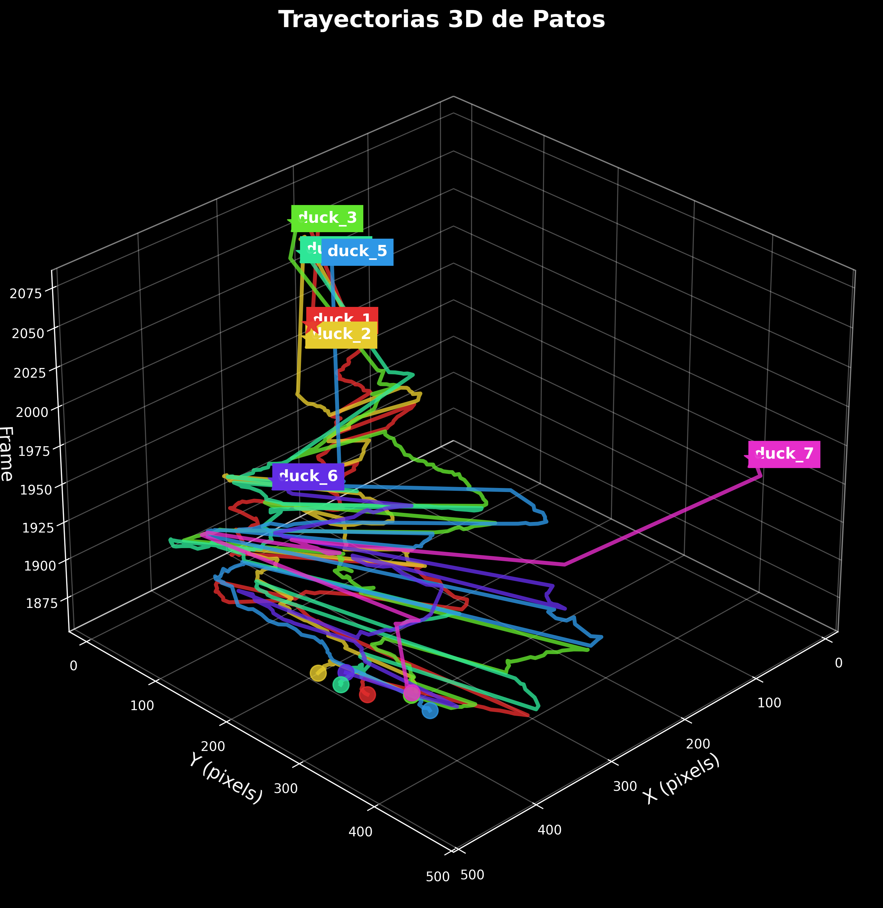

# Duck-Tracker Project

An advanced computer vision system for tracking and analyzing duck trajectories using YOLO object detection and Kalman filtering.

## 📊 [View Interactive Report](https://fluffy-flan-360713.netlify.app/)

<div align="center">
  
</div>

## Overview

This project implements a comprehensive system for tracking and analyzing duck movement in videos, utilizing YOLOv8 for detection and Kalman filters for tracking. The system generates rich visualizations of trajectories, statistical movement analysis, and interactive HTML reports that combine all data into an intuitive interface.

The Duck-Tracker system is designed to be both highly accurate and user-friendly, making it suitable for researchers, wildlife conservationists, and computer vision enthusiasts. By leveraging state-of-the-art object detection with YOLOv8 and implementing advanced tracking algorithms, the system can reliably track multiple ducks simultaneously even in challenging environments with occlusions and varied lighting conditions.

## Key Features

- 🦆 **Duck Detection & Tracking**: Precise identification and monitoring of ducks in video using YOLOv8
- 🔍 **Kalman Filtering**: Advanced motion prediction and trajectory smoothing
- 📈 **Trajectory Visualization**: Detailed 2D and 3D visualizations of movement patterns
- 🎬 **Animated Tracking**: Dynamic animations with vibrant color coding for individual tracking
- 📊 **Statistical Analysis**: Comprehensive movement metrics including velocity, acceleration, and directional analysis
- 📱 **Interactive HTML Reporting**: Rich, browser-based reports combining all visualizations and analyses
- 📹 **Cameraman Movement Analysis**: Tracking the cameraman's movement and rotation throughout the video

## Advanced Cameraman Movement Tracking

The project features sophisticated camera motion analysis that reconstructs the cameraman's path through 3D space. This functionality provides critical context to the duck tracking data by accounting for how camera movement affects the apparent motion of subjects in the frame.

The camera tracking system works by:

1. **Extracting Essential Matrices**: Computing frame-to-frame transformations using computer vision techniques
2. **Decomposing Camera Motion**: Breaking down movement into translation and rotation components
3. **Reconstructing 3D Trajectory**: Building a continuous path through 3D space
4. **Analyzing Motion Patterns**: Calculating displacement, velocity, and acceleration metrics
5. **Correlation Analysis**: Studying relationships between camera movement and tracking accuracy

This information helps differentiate between actual duck movement and apparent motion caused by camera panning, tilting, or walking. The resulting visualizations show the camera's path, orientation changes, and movement statistics throughout the video capture.

### Cameraman Visualization Examples

<div align="center">
  <table>
    <tr>
      <td></td>
      <td></td>
    </tr>
    <tr>
      <td></td>
      <td></td>
    </tr>
  </table>
</div>

## Project Structure

```
Duck-Tracker-Project/
├── batch_processing.py         # Batch video processing pipeline
├── create_animation.py         # Trajectory animation generation
├── create_report.py            # Interactive HTML report generation
├── duck_test1.py               # Main tracker class with Kalman filter
├── movement_analysis.py        # Statistical movement analysis
├── visualize_trajectories.py   # 2D and 3D trajectory visualization
├── cameraman_movement.py       # Cameraman movement analysis
├── visualize_cameraman.py      # Cameraman movement visualization
├── assets/                     # Sample videos and resources
├── batch_output/               # Processing results and visualizations
├── best.pt                     # Trained YOLOv8 model
└── camera_information/         # Camera calibration data
```

## Report Generation System

The project includes a sophisticated report generation system (`create_report.py`) that compiles all analyses, visualizations, and animations into an interactive HTML report. This system is designed to make complex data accessible and interpretable through a user-friendly interface.

### Key Components of the Report System:

- **Data Processing**: Integrates tracking data, movement metrics, and visualization outputs
- **Visualization Integration**: Embeds static and interactive visualizations in a cohesive layout
- **Statistical Analysis**: Presents comprehensive metrics with interpretive context
- **Interactive UI Elements**: Implements tabbed interfaces and interactive controls for data exploration
- **Responsive Design**: Ensures proper display across different devices and screen sizes
- **Multi-format Support**: Handles diverse data types including images, videos, 3D models, and tables
- **Code Documentation**: Includes highlighted source code with detailed explanations

### Report Features:

- **Rich Data Visualization**: Multiple charts, graphs, and 3D models to represent duck movements
- **Comprehensive Metrics**: Detailed statistics for each tracked duck including:
  - Total distance traveled
  - Average and maximum speeds
  - Acceleration patterns
  - Directional analysis
  - Movement efficiency
  - Spatial distribution and heat maps
  - Directional preference analysis
- **Interactive Elements**: Dynamic components for exploring the data
- **Code Documentation**: Highlighted code snippets explaining key algorithms
- **Cameraman Analysis Integration**: Dedicated section for cameraman movement analysis
- **Video Playback**: Embedded animations of duck trajectories and cameraman movement
- **3D Interactive Models**: Explorable 3D visualizations of movement data

The reporting system automatically handles missing data and can adapt to different analysis outputs, making it robust for various tracking scenarios. When generating the report, the system searches for visualizations in expected locations and includes them if available, providing informative messages for any missing components.

## Installation Requirements

```
numpy>=1.20.0
pandas>=1.3.0
matplotlib>=3.4.0
seaborn>=0.11.0
scipy>=1.7.0
tqdm>=4.62.0
ultralytics>=8.0.0
opencv-python>=4.5.0
pygments>=2.10.0
ffmpeg-python>=0.2.0
plotly>=5.5.0
```

## Installation

1. Clone the repository:
```bash
git clone https://github.com/AldonDC/Duck-Tracker-Project.git
cd Duck-Tracker-Project
```

2. Install dependencies:
```bash
pip install -r requirements.txt
```

## Usage

### 1. Process a video in batch mode:
```bash
python batch_processing.py --video assets/DuckVideo.mp4 --output batch_output/
```
This command processes the input video, detects ducks in each frame using YOLOv8, and applies Kalman filtering to track their movements. The results are saved as JSON files in the specified output directory.

### 2. Generate trajectory visualizations:
```bash
python visualize_trajectories.py --input batch_output/combined_data.json --output batch_output/visualizations/
```
This creates 2D and 3D visualizations of the duck trajectories, including heat maps and movement patterns, saving them to the visualizations folder.

### 3. Create animations:
```bash
python create_animation.py --input batch_output/combined_data.json --output batch_output/visualizations/
```
This generates animated visualizations of duck movements, creating both video (MP4) and GIF formats for easy sharing and integration into reports.

### 4. Analyze cameraman movement:
```bash
python cameraman_movement.py --intrinsics camera_information/intrinsics.npy --essential camera_information/essential_matrices.npy --output batch_output/cameraman_data/cameraman_movement.json
```
This analyzes the camera's intrinsic parameters and essential matrices between frames to reconstruct the cameraman's movement and orientation throughout the video.

### 5. Visualize cameraman movement:
```bash
python visualize_cameraman.py --input batch_output/cameraman_data/cameraman_movement.json --output batch_output/cameraman_visualizations/
```
This creates visualizations of the cameraman's trajectory, rotation, and displacement over time, providing context for understanding the duck movement patterns.

### 6. Generate HTML report with all analyses:
```bash
python create_report.py --data batch_output/combined_data.json --visualizations batch_output/visualizations/ --output batch_output/report/ --cameraman_visualizations batch_output/cameraman_visualizations/
```
This compiles all visualizations, animations, statistics, and analyses into a comprehensive interactive HTML report, organizing the information into logical sections with navigation controls.

### 7. View the report:
- Open `batch_output/report/informe_avanzado_patos.html` in any modern web browser
- Or visit [the online version on Netlify](https://fluffy-flan-360713.netlify.app/)

## Technical Details

The system implements several advanced computer vision and data processing techniques:

- **Object Detection**: Uses YOLOv8, trained to recognize ducks in various poses and lighting conditions
- **Multi-Object Tracking**: Implements Kalman filtering for robust tracking of multiple subjects simultaneously
- **Camera Motion Analysis**: Uses Structure from Motion (SfM) principles to reconstruct camera movement
- **3D Reconstruction**: Projects 2D coordinates into 3D space-time for comprehensive trajectory analysis
- **Statistical Analysis**: Applies time-series analysis to movement data, extracting behavioral patterns
- **Visualization Pipeline**: Implements a flexible visualization system supporting multiple output formats
- **Interactive Reporting**: Uses HTML5, CSS3, and JavaScript to create an interactive user experience

## Research Applications

This system can be applied to:
- Wildlife behavior analysis
- Movement pattern recognition
- Environmental monitoring
- Computer vision research
- Motion tracking algorithm development
- Camera stabilization and motion compensation
- Behavioral studies in controlled environments
- Educational demonstrations of computer vision concepts

## Links

- [GitHub Repository](https://github.com/AldonDC/Duck-Tracker-Project)
- [Interactive Report](https://fluffy-flan-360713.netlify.app/)

## License

This project is available under the MIT License - see the LICENSE file for details.
